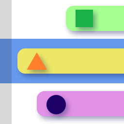

# 概述

关卡的流程控制都由 `LevelRunner` 组件控制，其中也保存着关卡的数据。
- **BPM** 关卡中音乐的每分钟拍数。
- **Level Beats** 关卡中音乐总共包含的拍数。
- **_Time Line Progress_** 仅用于编辑，改变当前所在的拍数时间节点，改变后会看到当前场景预览的改变，所有在当前拍数存在的物体都会出现在场景当中。
**_Current Beat__** 的效果相同，只是提供更加精确的控制。
按下 **Add Block At Current Beat** 会自动添加空白物体，InTime将会变为当前拍数，默认时长为 1 拍。

# 编辑
按下Edit按钮后进入编辑模式，时间会自动切换到该物体出现的时间点，并出现Handle方便可视化控制，也可使用面板属性进行精确控制。

